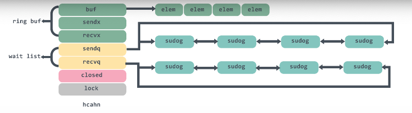
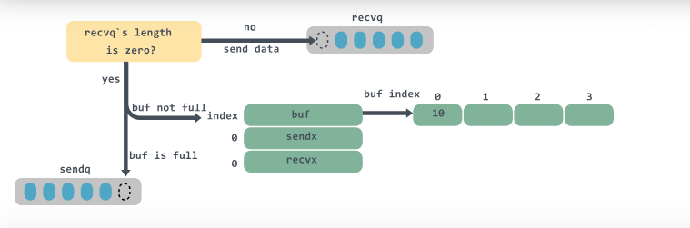

```
type hchan struct {
    qcount      uint            // 循环列表元素个数        
    dataqsiz    uint            // 循环队列的大小
    buf         unsafe.Pointer  // 循环队列的指针
    elemsize    uint16          // chan中元素大小
    closed      uint32          // 是否已close
    elemtype    *_type          // chan中元素类型
    sendx       uint            // send在buffer中的索引
    recvx       uint            // recv在buffer中的索引
    recvq       waitq           // receiver的等待队列
    sendq       waitq           // sender的等待队列
    lock        mutex           // 互斥锁
}
```
#### qcount代表chan中已经收取但还没被取走的元素的个数，函数len可以返回这个字段的值；
#### dataqsiz和buf分别代表队列buffer的大小，cap函数可以返回这个字段的值以及队列buffer的指针，是一个定长的环形数组；
#### elemtype和elemsiz表示chan中元素的类型和元素的大小；
#### sendx：发送数据的指针在buffer中的位置；
#### recvx: 接收请求时的指针在buffer中的位置；
#### recvq和sendq分别表示等待接收数据的goroutine与等待发送数据的goroutine；
#### sendq和recvq的类型是waitq的结构体：
```
type waitq struct {
    first *sudog
    last  *sudog
}
```
#### waitq里面连接的是一个sudog双向链表，保存的是等待的goroutine，整个chan的图例大概是这样：

下面看一下创建chan，我们通过汇编结果也可以查看到make(chan int)这句代码会调用到runtime的makechan函数中：
```
const (
    maxAlign = 8
    hchanSize = unsafe.Sizeof(hchan{}) + uintptr(-int(unsafe.Sizeof(hchan{}))&(maxAlign-1))
)

func makechan(t *chantype, size int) *hchan {
    elem := t.elem
    // 略去检查代码
    ...
    // 计算需要分配的buff空间
    mem,overflow := math.MulUintptr(elem.size, uintptr(size))
    if overfilow || mem > maxAlloc - hchanSize || size < 0 {
        panic(plainError("makechan: size out of range"))
    }
    
    var c *hchan
    switch {
        case mem == 0:
            // chan的size或者元素的size是0，不必创建buf
            c = (*hchan)(mallocgc(hchanSize, nil, true))
            // Race datector
            c.buf = c.raceaddr()
        case elem.ptrdata == 0:
            // 元素不是指针，分配一块连续的内存给hchan数据结构和buf
            c = (*hchan)(mallocgc(hchanSize+mem, nil, true))
            // 表示hchan后面在内存里紧跟着就是buf
            c.buf = add(unsafe.Pointer(c), hchanSize)
        default:
            // 元素包含指针，那么单独分配buf
            c = new(hchan)
            c.buf = mallocgc(mem, elem, true)     
    }
    
    c.elemsize = uint16(elem.size)
    c.elemtype = elem
    c.dataqsiz = uint(size)
    
    return c
}
```
#### 首先我们可以看到计算hchanSize:
```
maxAlign = 8
hchanSize = unsafe.Sizeof(hchan{}) + uintptr(-int(unsafe.Sizeof(hchan{}))&(maxAlign-1))
```
#### maxAlign是8，那么maxAlign-1的二进制就是111，然后和int(unsafe.Sizeof(hchan{}))取与就是取它的低三位，hchanSize就得到的是8的倍数，做对齐使用。
#### 这里switch有三种情况，第一种情况是缓冲区所需大小为0，那么在为hchan分配内存时，只需分配sizeof(hchan)大小的内存；
#### 第二种情况是缓冲区锁大小不为0，而且数据类型不包含指针，那么就分配连续的内存。注意的是，我们在创建channel的时候可以指定类型为指针类型：
```
// chan里存入的是int的指针
c := make(chan *int)
// chan里存入的是int的值
c := make(chan int)
```
#### 第三种情况是缓冲区所需大小不为0，而且数据类型包含指针，那么就不使用add的方式让hchan和buf放在一起了，而是单独的为buf申请一块内存。

### 发送数据
#### channel的阻塞非阻塞
#### 在看发送数据的代码之前，我们先看一下什么是channel的阻塞和非阻塞。
#### 一般情况下，传入的参数都是block=true，即阻塞调用，一个往channel中插入数据的goroutine会阻塞到插入成功为止。
##### 非阻塞只是这种情况：
```
select {
    case c <- v:
        ... foo
    default:
        ... bar    
}
```
##### 编译器会将其改为：
```
if selectnbsend(c, v) {
    ... foo
} else {
    ... bar
}
```
##### selectnbsend方法传入block就是false:
```
func selectnbsend(c *hchan, elem unsafe.Pointer) (selected bool) {
    return chansent(c, elem, false, getcallerpc())
}
```
##### chansend方法
##### 向通道发送数据我们通过汇编结果可以发现是在runtime中通过chansend实现的，方法比较长，下面我们分段进行理解：
```
func chansend(c *hchan, ep unsafe.Pointer, block bool, callerpc uintptr) bool {
    if c == nil {
        // 对于非阻塞的发送，直接返回
        if !block {
            return false
        }
        
        // 对于阻塞的通道，将goroutine挂起
        gopark(nil, nil, waitReasonChanSendNilChan, traceEvGoStop, 2)
        throw("unreachable")
    }
    ...
}
```
##### 这里会对chan做一个判断，如果它是空的，那么对于非阻塞的发送，直接返回false；对于阻塞的通道，将goroutine挂起，并且永远不会返回。
```
func chansend(c *hchan, ep unsafe.Pointer, block bool, callerpc uintptr) bool {
    ...
    // 非阻塞的情况下，如果通道没有关闭，满足以下一条：
    // 1、没有缓冲区并且当前没有接收者
    // 2、缓冲区不为0，并且已满
    if !block && c.closed == 0 && ((c.dataqsiz == 0 && c.recvq.first == nil) || (c.dataqsiz > 0 && c.qcount == c.dataqsiz)) {
        return false
    }
}
```
##### 需要注意的是这里是没有加锁的，go虽然在使用指针读取单个值的时候是原子性的，但是读取多个值并不能保证，所以在判断完closed虽然是没有关闭的，那么在读取完之后依然可能在这一瞬间从未关闭状态转变成关闭状态，那么就有两种可能：
##### 通道没有关闭，而且已经满了，那么需要返回false，没有问题；
##### 通道关闭，而且已经满了，但是在非阻塞的发送中返回false,也没有问题；
#### 上面的这些判断被称为fast path,因为加锁的操作是一个重要的操作，所以能够在加锁之前返回的判断就在加锁之前做好是最好的。
#### 下面接着看看加锁部分的代码：
```
func chansend(c *hchan, ep unsafe.Pointer, block bool, callerpc unitptr) bool {
    ...
    // 加锁
    lock(&c.lock)
    // 是否关闭的判断
    if c.closed != 0 {
        unlock(&c.lock)
        panic(plainError("send on closed channel"))
    }
    // 从recvq中取出一个接收者
    if sg := c.recvq.dequeue(); sg != nil {
        // 如果接收者存在，直接向该接收者发送数据，绕过buffer
        send(c, sg, ep, func() {unlock(&c.lock)}, 3)
        return true
    }
    ...
}
```
#### 进入了lock区域之后还需要再判断以下close的状态，然后从recvq中取出一个接收者，如果已经有接收者，那么就向第一个接收者发送当前enqueue的消息。这里需要注意的是如果有接收者在队列中等待，则说明此时的缓冲区是空的。
#### send代码如下：
```
func send(c *hchan, sg *sudog, ep unsafe.Pointer, unlockf func(), skip int) {
    ...
    if sg.elem != nil {
        // 直接把要发送的数据copy到reciever的栈空间
        sendDirect(c.elemtype, sg, ep)
        sg.elem = nil
    }
    gp := sg.g
    unlickf()
    gp.param = unsafe.Pointer(sg)
    if sg.releasetime != 0 {
        sg.releasetime = cputicks()
    }
    // 唤醒对应的 goroutine
    goready(gp, skip+1)
}
```
#### 在send方法里，sg就是goroutine打包好的对象，ep是对应要发送数据的指针，sendDirect方法会调用memmove进行数据的内存拷贝，然后goready函数会唤醒对应的goroutine进行调度。
#### 回到chansend方法，继续往下看：
```
func chansend(c *hchan, ep unsafe.Pointer, block bool, calleroc uintptr) bool {
    ...
    // 如果缓冲区没有满，直接将要发送的数据赋值到缓冲区
    if c.qcount < c.dataqsiz {
        // 找到buf要填充数据的索引位置
        qp := chanbuf(c, c.sendx)
        ...
        // 将数据拷贝到buffer中
        typedmemmove(c.elemtype, qp, ep)
        // 数据索引迁移，如果到了末尾，又从0开始
        c.send++
        if c.sendx == c.dataqsiz {
            c.sendx = 0
        }
        // 元素个数加1，释放锁并返回
        c.qcount++
        unlock(&c.lock)
        return true
    }
}
```
#### 这里会判断buf缓冲区有没有满，如果没有满，那么就找到buf要填充数据的索引位置，调用typedmemmove方法将数据拷贝到buf中，然后重新设置sendx偏移量。
```
func chansend(c *hchan, ep unsafe.Pointer, block bool, callerpc uintptr) bool {
    ...
    // 缓冲区没有空间了，所以对非阻塞调用直接返回
    if !block {
        unlock(&c.lock)
        return false
    }
    // 创建sudog对象
    gp := getg()
    mysg := acquireSudog()
    mysg.releasetime = 0
    if t0 != 0 {
        mysg.releasetime = -1
    }
    mysg.elem = ep
    mysg.waitlink = nil
    mysg.g = gp
    mysg.isSelect = false
    mysg.c = c
    gp.waiting = mysg
    gp.param = nil
    // 将sudog对象入队
    c.sendq.enqueue(mysg)
    // 进入等待状态
    gopark(chanparkcommit, unsafe.Pointer(&c.lock), waitReasonChanSend, traceEvGoBlockSend, 2)
    ...
}
```
#### 这里会做两部分的操作，对于非阻塞的调用会直接返回；对于阻塞的调用会创建sudog对象，然后将sudog对象入队之后gopark将goroutine转入waiting状态，并解锁。调用gopark之后，在使用者看来该向channel发送数据的代码语句会进行阻塞。
#### 这里也需要注意一下，如果缓冲区为0，那么也会进入到这里，会调用到gopark立马阻塞，所以在使用的时候需要记得接收数据，防止向chan发哦是哪个数据的那一端永远阻塞，如：
```
func process(timeout time.Duration) bool {
    ch := make(chan bool)
    
    go func() {
        // 模拟处理耗时业务
        time.Sleep((timeout + time.Second))
        ch <- true // block
        fmt.Println("exit goroutine")
    }()
    select {
        case result := <- ch:
            return result
        case <-time.After(timeout)
            return false
    }
}
```
#### 如果这里在select的时候直接timeout了，而没有调用 result := <-ch，那么goroutine就会永远阻塞。
#### 到这里发送的代码就讲解完了，整个流程大致如下：
#### 比如我要执行： ch<-10

#### 1、检查recvq是否为空，如果不为空，则从recvq头部取一个goroutine,将数据发送过去；
#### 2、如果recvq为空，并且buf没有满，则将数据放入到buf中；
#### 3、如果buf已满，则将要发送的数据和当前goroutine打包成sudog，然后入队到sendq队列中，并将当前goroutine置为waiting状态进行阻塞。


