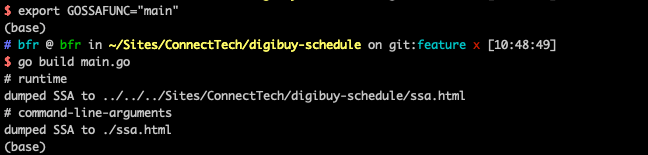

### $env:GOSSAFUNC="main"
设置环境变量 GOSSAFUNC 是为了开启 Go 编译器的 SSA (Static Single Assignment) 形式的中间表示的日志和可视化输出，而这通常用于深入理解 Go 代码是如何被编译器转换和优化的。这个特性主要被编译器开发者和那些对 Go 底层实现感兴趣的高级用户所使用。
如何使用该变量进行编译和查看输出
设置环境变量:
在 PowerShell 中，你可以通过以下命令设置环境变量，以便在编译时生成特定函数的 SSA 输出：

### $env:GOSSAFUNC="main" 
### mac环境  export GOSSAFUNC="main"
编译 Go 程序:
在设置了 GOSSAFUNC 后，编译你的 Go 程序:

### go build main.go
这将生成 main 函数的 SSA 输出，通常包括多个阶段的详细信息和图形表示。

查看输出:
SSA 输出通常会生成在当前目录的 HTML 文件中，你可以通过浏览器打开这些 HTML 文件来查看编译过程中的详细信息和图形化的流程。

注意事项
目标函数:
GOSSAFUNC 的值应该是你想要查看 SSA 输出的具体函数的名字。如果你对 main 函数以外的其他函数感兴趣，可以将环境变量的值改为相应的函数名。

性能影响:
开启 SSA 输出会使编译过程变慢，因为需要额外的时间来生成详细的日志和图形输出。仅在需要深入分析时使用这一功能。

用途:
这一功能主要用于性能优化和理解 Go 编译器的行为，对于普通的应用开发通常不必使用。

通过使用 GOSSAFUNC 环境变量，高级用户和开发者可以获得关于 Go 代码如何被转换成机器代码的深入视角，这有助于优化性能和理解潜在的编译器优化。

### Go编译过程：
    编译前端：词法分析->句法分析->语义分析
    编译后端：中间码生成->代码优化->机器码生成->链接  

### 查看Plan9汇编代码
    go build -gcflags -S main.go