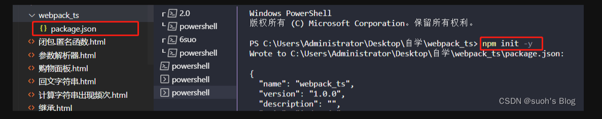
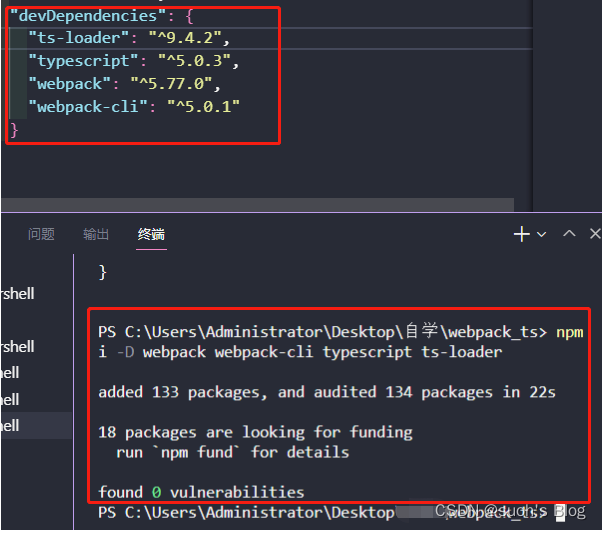
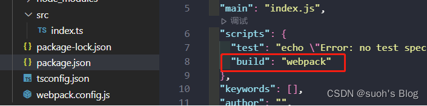
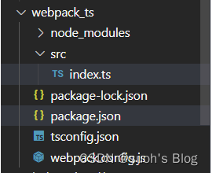
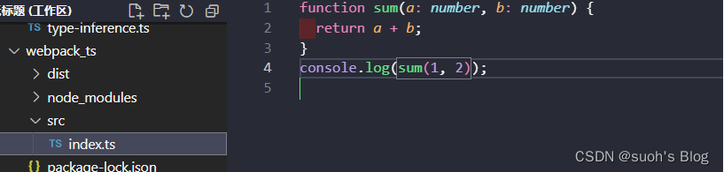
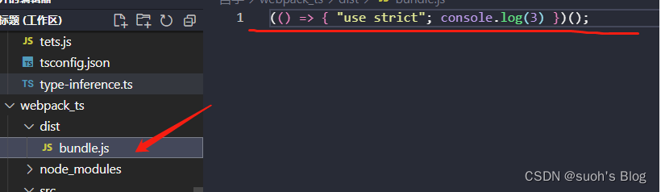

这篇文章主要讲解  如何通过webpack对我们的代码进行编译？

因为ts不可能脱离打包工具来进行运行，因此我们需要掌握的就是如何在webpack中打包ts代码。

首先创建一个文件夹，并对该文件夹进行初始化，npm init -y，目的是生成一个package.json文件

接着我们需要安装wedpack所需要的依赖

安装的ts 及 ts-loader就是为了webpack能与ts进行整合

npm i -D webpack webpack-cli typescript ts-loader

此时就安装好了

此时我们需要对webpack进行一个基本的配置，才能使用webpack基本的功能

新建一个webpack.config.js 

// 引入一个包
const path = require('path')

// webpack中所有的配置信息都应该写在module.exports中
module.exports = {
// 指定入口文件
entry: "./src/index.ts",
// 指定打包文件所在目录
output: {
// 指定打包文件目录
path: path.resolve(__dirname, 'dist'),
// 打包后的文件名
filename: "bundle.js"
},
// 指定webpack打包时要使用模块
module: {
// 指定图片、资源等要加载的规则
rules: [
{
// test指定的是规则生效的文件
test: /\.ts$/,//匹配所有以ts结尾的文件
use: 'ts-loader',//用ts-loader去处理以ts结尾的文件
// 要排除的文件
exclude: /node-modules/
}
]
}
}

配置好后，我们要想对ts进行编译，还需要定义一个ts的编译规范，所以还需要创建一个 tsconfig.json，我们简单设置几个属性

{
// compilerOptions编译器的选项
"compilerOptions": {
// target 用来指定ts被编译为ES的版本，默认是ES3
// 可以是 'es3', 'es5', 'es6', 'es2015', 'es2016', 'es2017','es2018','es2019','es2020','esnext'.
"target": "ES6",
// module 指定要使用的模块化的规范
"module": "CommonJS",
// 所有严格检查的总开关
"strict": false,
},

}

在package.json中我们还需要加一个命令来进行打包，通过build命令来执行webpack

这样我们最基本的ts+webpack的组合就完成了

项目目录：

此时我们在index.ts中编写一段ts代码

再进行打包，可以看到代码已经被转换为了js代码

那基本的配置好了之后，我们还需要一个入口html文件去加载js资源，

此时需要安装一个插件，他的作用就是给我们自动生成一个html文件，然后再去加载相关资源

